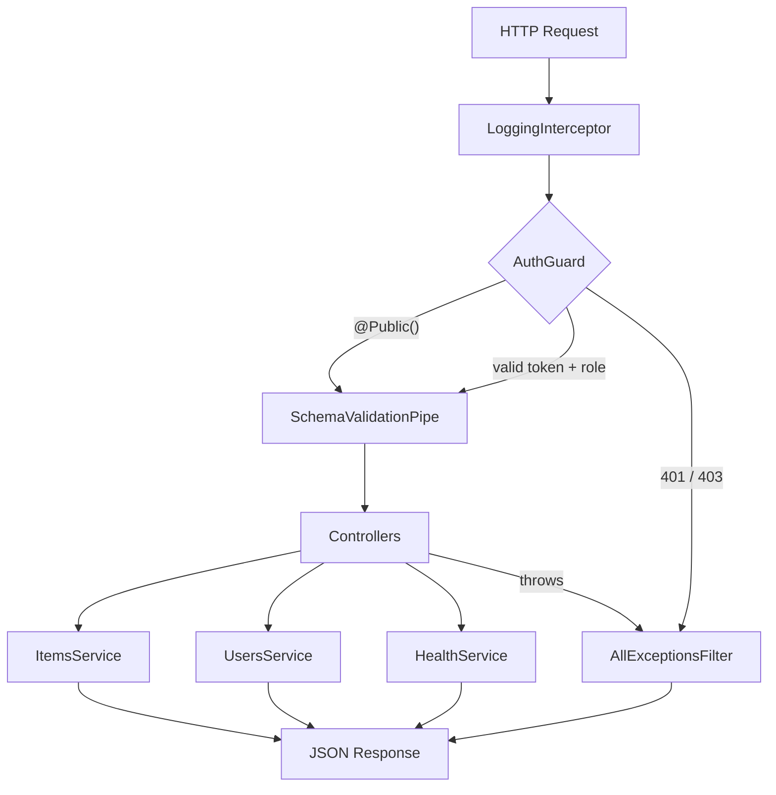

<div align="center">
  

  <h1>nestjs-boilerplate</h1>

  <p><strong>A production-shaped NestJS + TypeScript starter — auth, validation, health, and pagination, fully typed and fully tested.</strong></p>

  <p>Built and maintained by <strong>Viprasol Tech</strong>.</p>

[](https://github.com/Viprasol-Tech/nestjs-boilerplate/actions/workflows/ci.yml)
[](LICENSE)
[](https://www.typescriptlang.org/)
[](https://nestjs.com/)
[](https://vitest.dev/)
[](#-testing)
[](CHANGELOG.md)

</div>

A clean, batteries-included NestJS starter that demonstrates the cross-cutting concerns every real backend needs — **bearer-token auth with roles**, a **global validation pipe**, a **uniform exception filter**, a **logging interceptor**, **health checks**, and **pagination** — wired across two example feature modules. Everything is strict TypeScript and exercised by **94 unit tests** with `@nestjs/testing`, and it runs with **zero infrastructure** (in-memory stores) so you can clone and go.

## ✨ Features

- 🔐 **Auth guard + roles** — `AuthGuard` authenticates `Bearer` tokens and authorizes against `@Roles()`; `@Public()` opts routes out, `@CurrentUser()` injects the principal. Pluggable `TokenVerifier`.
- ✅ **Global validation pipe** — `SchemaValidationPipe` maps DTO classes to validators and raises `BadRequestException`s with the offending `field` — no heavy `class-validator` dependency required.
- 🧯 **Exception filter** — `AllExceptionsFilter` returns a consistent JSON error envelope and hides internals for unexpected errors.
- 📈 **Logging interceptor** — `LoggingInterceptor` records method, path, and request duration (injectable clock for deterministic tests).
- ❤️ **Health module** — `GET /health` (readiness, `503` when any check is down) and `GET /health/live` (liveness), with an extensible check registry.
- 📄 **Pagination** — `parsePaginationQuery` + `paginate` give clamped, validated paging and a rich `PaginatedResult` envelope.
- 🧩 **Two feature modules** — `ItemsModule` (CRUD basics) and `UsersModule` (unique-email CRUD, roles, pagination, admin-only delete).
- 🛡️ **Strict TypeScript** with `experimentalDecorators` and `emitDecoratorMetadata`, ESM throughout.
- 🧪 **94 real unit tests** driving services, controllers, guards, pipes, filters, and interceptors.

## 📦 Install

```bash
git clone https://github.com/Viprasol-Tech/nestjs-boilerplate.git
cd nestjs-boilerplate
npm install
```

## 🚀 Quickstart

Compose the modules into your app and register the cross-cutting providers in `main.ts`:

```ts
import "reflect-metadata";
import { NestFactory, Reflector } from "@nestjs/core";
import {
  AppModule,
  AuthGuard,
  InMemoryTokenVerifier,
  SchemaValidationPipe,
  CreateItemDto,
  validateCreateItemDto,
  CreateUserDto,
  validateCreateUserDto,
} from "nestjs-boilerplate";

async function bootstrap() {
  const app = await NestFactory.create(AppModule);

  // Auth: verify bearer tokens against your identity source.
  const verifier = new InMemoryTokenVerifier({
    "admin-token": { id: "1", roles: ["admin"] },
  });
  app.useGlobalGuards(new AuthGuard(app.get(Reflector), verifier));

  // Validation: register DTO validators once, apply globally.
  const pipe = new SchemaValidationPipe()
    .register(CreateItemDto, validateCreateItemDto)
    .register(CreateUserDto, validateCreateUserDto);
  app.useGlobalPipes(pipe);

  await app.listen(3000);
}

bootstrap();
```

> The global **exception filter** and **logging interceptor** are already registered inside `AppModule` via `APP_FILTER`/`APP_INTERCEPTOR`, so they work out of the box.

### Use the building blocks directly

```ts
import { UsersService, parsePaginationQuery } from "nestjs-boilerplate";

const users = new UsersService();
users.create({ name: "Ada", email: "ada@example.com", roles: ["admin"] });

const page = users.findAll(parsePaginationQuery({ page: 1, limit: 10 }));
// => { data: [ { id: 1, ... } ], meta: { total: 1, totalPages: 1, ... } }
```

## 🧭 Architecture



## 📚 API

### Endpoints

| Method | Path           | Auth            | Description                                  |
| ------ | -------------- | --------------- | -------------------------------------------- |
| GET    | `/health`      | public          | Readiness report (`503` when a check is down) |
| GET    | `/health/live` | public          | Liveness probe (always `200` while running)   |
| GET    | `/items`       | token           | List all items                                |
| POST   | `/items`       | token           | Create an item (validated)                    |
| GET    | `/items/:id`   | token           | Fetch a single item                           |
| GET    | `/users`       | token           | Paginated list (`?page=&limit=`)              |
| POST   | `/users`       | token           | Create a user (validated, unique email)       |
| GET    | `/users/:id`   | token           | Fetch a single user                           |
| DELETE | `/users/:id`   | role: `admin`   | Delete a user                                 |

### Building blocks

| Export                  | Kind        | Purpose                                            |
| ----------------------- | ----------- | -------------------------------------------------- |
| `AuthGuard`             | Guard       | Bearer-token auth + role authorization             |
| `Roles` / `Public`      | Decorator   | Declare required roles / mark a route public        |
| `CurrentUser`           | Param dec.  | Inject the authenticated user (or one field)        |
| `InMemoryTokenVerifier` | Provider    | Token → user mapping (swap for JWT in prod)         |
| `SchemaValidationPipe`  | Pipe        | Metatype-keyed DTO validation → `BadRequest`        |
| `AllExceptionsFilter`   | Filter      | Uniform JSON error envelope                         |
| `LoggingInterceptor`    | Interceptor | Per-request method/path/duration logging           |
| `HealthService`         | Service     | Extensible readiness/liveness checks               |
| `parsePaginationQuery`  | Helper      | Validate + clamp `page`/`limit`                     |
| `paginate`              | Helper      | Slice a collection into a `PaginatedResult`         |

## 🧪 Testing

```bash
npm run build      # compile to dist/ with tsc
npm run typecheck  # tsc --noEmit (zero errors)
npm test           # run the Vitest suite (94 tests)
```

The suite covers each layer in isolation using `Test.createTestingModule` and a lightweight `ExecutionContext` double, so guards, pipes, filters, and interceptors are tested without bootstrapping a full HTTP server.

## 🗺️ Roadmap

- [x] Auth guard with bearer tokens and `@Roles()`
- [x] Global validation pipe, exception filter, logging interceptor
- [x] Health module and pagination primitives
- [x] Second feature module (`UsersModule`)
- [ ] JWT-based `TokenVerifier` implementation
- [ ] Rate-limiting guard
- [ ] OpenAPI/Swagger document generation
- [ ] Optional TypeORM/Prisma persistence adapters

## ❓ FAQ

**Why no `class-validator`?**
To keep the starter dependency-light and the validation logic explicit and testable. `SchemaValidationPipe` accepts any validator function, so dropping in `class-validator` later is trivial.

**How do I swap the in-memory stores for a database?**
Replace the internal arrays in `ItemsService`/`UsersService` with repository calls and push `offset`/`limit` (from `PaginationQueryDto`) into your query — `paginate` accepts a pre-counted `total` for exactly this.

**Is the auth production-ready?**
The structure is; the `InMemoryTokenVerifier` is a demo. Implement `TokenVerifier` with JWT verification or an identity provider and inject it into `AuthGuard`.

## 🤝 Contributing

Contributions are welcome! Please read [CONTRIBUTING.md](CONTRIBUTING.md) and our [Code of Conduct](CODE_OF_CONDUCT.md) before opening a pull request.

## Contact — Viprasol Tech Private Limited

- Website: [viprasol.com](https://viprasol.com)
- Email: [support@viprasol.com](mailto:support@viprasol.com)
- Telegram: [t.me/viprasol_help](https://t.me/viprasol_help) | WhatsApp: +91 96336 52112
- GitHub: [@Viprasol-Tech](https://github.com/Viprasol-Tech) | [LinkedIn](https://www.linkedin.com/in/viprasol/) | X [@viprasol](https://twitter.com/viprasol)

## License

[MIT](LICENSE) (c) 2025 Viprasol Tech Private Limited
